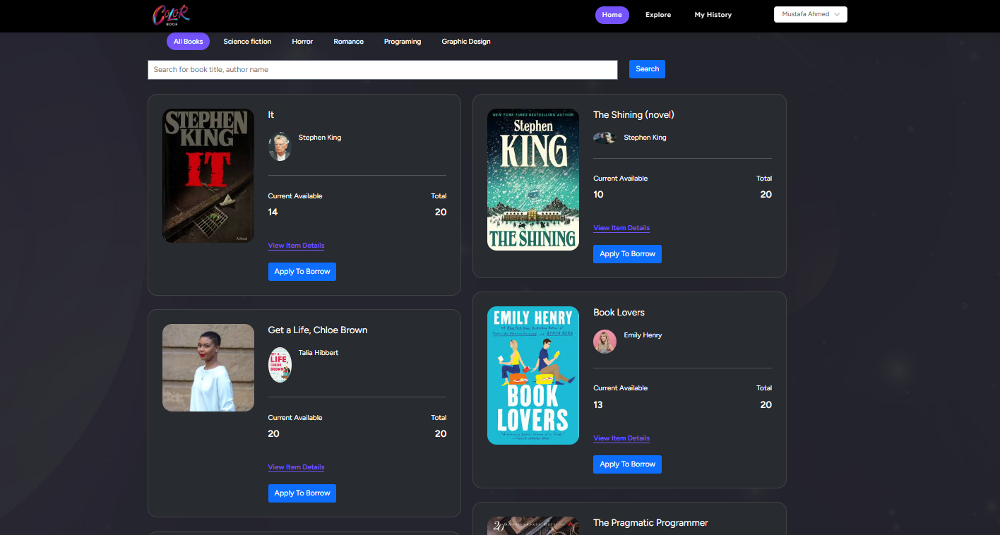

# 📚 Library Management System

A web-based Library Management System built with Laravel. It includes features for managing books, users, categories, and borrowing records, with full admin and user interfaces.

---

## 🚀 Features

- 👤 **User Management** (Laravel Fortify & Jetstream)
- 📚 **Book & Category Management** (CRUD)
- 🕵️‍♂️ **Admin Panel**
- 🔁 **Book Borrowing System**
- 📊 **Dashboard with Charts**
- 🔐 **Secure Authentication**
- 📩 **Email Notifications**
- 🧪 **Testing Support**
- 📱 **API Token Manager**

---

## 🛠️ Tech Stack

**Backend:** Laravel, PHP, Eloquent ORM  
**Frontend:** Blade, Bootstrap, jQuery, Chart.js, Font Awesome  
**Database:** MySQL (via Laravel Migrations)  
**Dev Tools:** Vite, TailwindCSS, PHPUnit

---

## 📂 Key Structure

- `app/Models/` – Book, User, Category, Borrow
- `app/Http/Controllers/` – Admin, User, Auth Logic
- `resources/views/` – Blade Templates
- `routes/web.php` – Web Routes
- `routes/api.php` – API Routes
- `public/photos/` – Book & Author Images
- `tests/` – Feature & Unit Tests

---

## 🖥️ Getting Started

1. **Clone the Repo**

   ```bash
   git clone https://github.com/Hassanoli/Library-Management-System.git
   cd Library-Management-System
   ```

2. **Install Dependencies**

   ```bash
   composer install
   npm install && npm run build
   ```

3. **Set Environment**

   ```bash
   cp .env.example .env
   php artisan key:generate
   ```

4. **Setup Database**

   ```bash
   php artisan migrate --seed
   ```

5. **Run App**

   ```bash
   php artisan serve
   ```

---

## 🖼️ Screenshots




---

## 📌 Notes

- ❌ `.env` and sensitive credentials are ignored (see `.gitignore`)
- 🔐 Store secrets in `.env`, **not in source code**
- 🧪 For testing, run: `php artisan test`

---

## 📫 Contact

- GitHub: [Hassanoli](https://github.com/Hassanoli)
- Email: hassanmohamedali0113@gmail.com

---

> 💬 *Need help running the system or contributing? Feel free to open an issue or contact me!*
